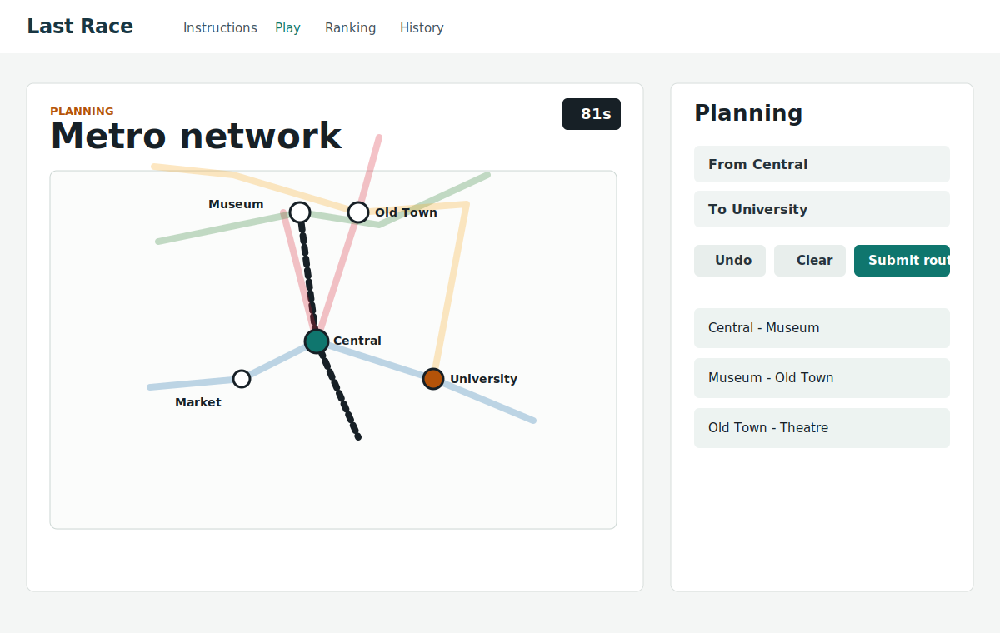
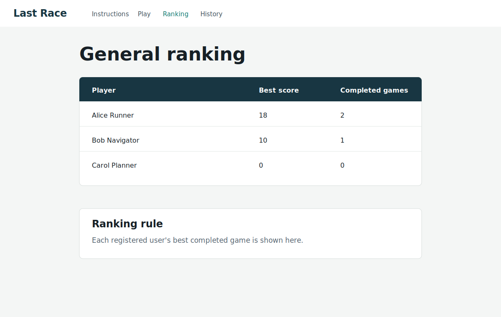

# Exam #1: "Last Race"
## Student: s123456 LASTNAME FIRSTNAME

## React Client Application Routes

- Route `/`: public instructions page. Anonymous users can read the rules but cannot see the network map.
- Route `/login`: login form for registered users.
- Route `/play`: protected game page with setup, planning, execution, and result phases.
- Route `/ranking`: protected page showing the best score of each registered user.
- Route `/history`: protected page showing the logged-in user's games.

## API Server

- GET `/api/health`: returns `{ status: "ok" }`.
- GET `/api/instructions`: public game instructions.
- POST `/api/sessions`: login with `{ username, password }`; creates a session cookie and returns the public user.
- GET `/api/sessions/current`: returns the currently logged-in user or `null`.
- DELETE `/api/sessions/current`: logs out and destroys the session.
- GET `/api/network`: protected; returns stations, lines, and connected station segments.
- POST `/api/games`: protected; creates a new game with random start/destination at least 3 stops apart.
- POST `/api/games/:id/route`: protected; validates the submitted ordered segment ids, applies random events, stores the result.
- GET `/api/games/history`: protected; returns completed and in-progress games for the logged-in user.
- GET `/api/ranking`: protected; returns each user's best completed score.

## Database Tables

- Table `users`: registered users with unique username, display name, and bcrypt password hash.
- Table `stations`: metro stations with unique name and map coordinates.
- Table `metro_lines`: line name and color.
- Table `line_stations`: ordered stations for each line; this models interchanges without duplicating stations.
- Table `events`: possible random events with an effect from -4 to +4.
- Table `games`: one game session, assigned start/destination, status, and final score.
- Table `game_steps`: executed route steps with selected event and coins after each step.

## Main React Components

- `App`: defines routes and session state.
- `PageShell`: shared navigation and login/logout area.
- `HomePage`: public instructions screen.
- `LoginPage`: registered user login form.
- `PlayPage`: coordinates setup, planning, execution, and result phases.
- `NetworkMap`: SVG map renderer for full-map and planning views.
- `RouteBuilder`: segment list and selected-route controls.
- `ExecutionView`: step-by-step event display.
- `RankingPage`: general ranking table.
- `HistoryPage`: logged-in user's game history.

## Screenshot





## Users Credentials

- `alice`, password `password`
- `bob`, password `password`
- `carol`, password `password`

## Run Instructions

From a fresh clone:

```bash
(cd server ; npm install; nodemon index.js)
(cd client ; npm install; npm run dev)
```

The seeded SQLite database is stored in `server/data/last_race.sqlite`. To reset it during development:

```bash
cd server
npm run init-db
```

On Windows PowerShell, use `npm.cmd run init-db` if script execution blocks `npm`.

## Use of AI Tools

AI assistance was used to plan and implement the database layer, Express APIs, authentication flow, route validation logic, and React UI. The output was adapted to the exam requirements and verified with database initialization, server API calls, client linting, and a production client build.
