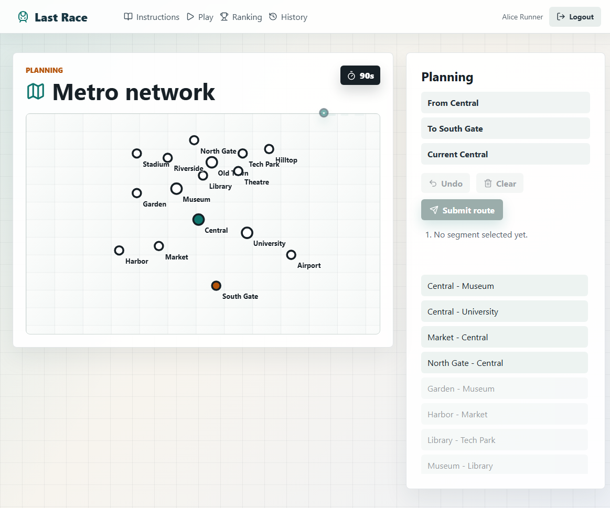
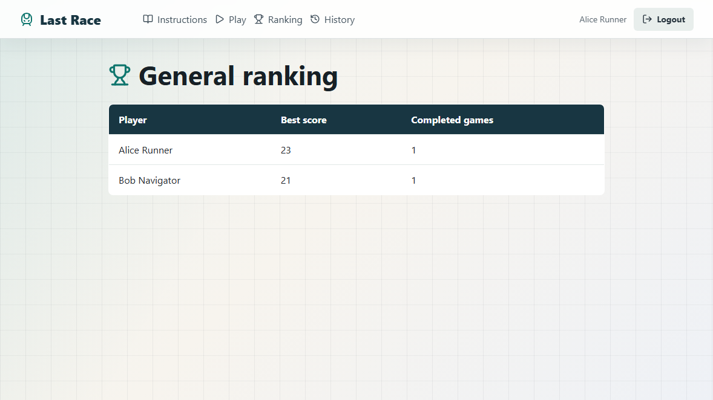

# Exam #1: Last Race

## Student

- Student: Ashkan Shafiei
- Student ID: s342583
- Course: Web Applications I, 2025/2026

## Project Overview

Last Race is a single-player React and Node.js web application inspired by an underground route-planning game. Registered users study a fixed metro network, plan a hidden route within 90 seconds, and execute the route while random events update their coin score.

Anonymous visitors can only read the instructions. Authenticated users can play games, inspect their history, and view the general ranking.

## React Client Application Routes

- `/`: public instructions page; anonymous users can read the rules without seeing the network map.
- `/login`: login form for the registered users seeded in the database.
- `/play`: protected game page implementing setup, planning, execution, and result phases.
- `/ranking`: protected page showing each ranked user's best completed score.
- `/history`: protected page showing the logged-in user's previous and in-progress games.

## API Server

- `GET /api/health`: returns `{ status: "ok" }`.
- `GET /api/instructions`: returns the public game instructions.
- `POST /api/sessions`: authenticates `{ username, password }`, creates a session cookie, and returns the public user object.
- `GET /api/sessions/current`: returns the current public user object, or `null` when no session exists.
- `DELETE /api/sessions/current`: logs out and destroys the current session.
- `GET /api/network`: protected; returns stations, lines, and public connected segments for setup.
- `POST /api/games`: protected; creates a game with a random reachable start/destination pair at least 3 stops apart, returns the station-only planning map and the public segment list.
- `POST /api/games/:id/route`: protected; enforces the planning deadline, validates the submitted ordered segment ids, applies random events, and stores the score.
- `GET /api/games/history`: protected; returns the logged-in user's games ordered by creation date.
- `GET /api/ranking`: protected; returns each user's best completed score for the general ranking.

## Database Tables

- `users`: registered users with unique username, display name, and salted bcrypt password hash.
- `stations`: fixed metro stations with unique name and map coordinates.
- `metro_lines`: metro line names and display colors.
- `line_stations`: ordered station membership for each line; interchange stations are represented by shared station ids.
- `events`: random execution events with an integer effect between `-4` and `+4`.
- `games`: game sessions with owner, start/destination stations, status, timestamps, and final score.
- `game_steps`: executed route steps with selected event and coin total after each step.

## Seeded Initial Data

The SQLite database is designed and pre-populated by the project in `server/init_db.js`.

- 4 metro lines: Red Line, Blue Line, Green Line, Yellow Line.
- 16 stations, including 4 interchange stations: Central, Museum, Old Town, University.
- 8 random events with effects in the required `-4` to `+4` range.
- 3 registered users.
- 2 registered users with already completed games.

## Main React Components

- `App`: application routes and session state.
- `PageShell`: shared layout, navigation, and login/logout area.
- `HomePage`: public instructions screen.
- `LoginPage`: registered-user login form.
- `PlayPage`: game state coordinator for setup, planning, execution, and result phases.
- `NetworkMap`: SVG metro map renderer; setup shows named lines and connections, planning shows only stations plus the selected route.
- `LineLegend`: setup-only legend for the fixed metro lines.
- `RouteBuilder`: segment list, selected route, undo, clear, and submit controls.
- `ExecutionView`: step-by-step display of events and updated coin totals.
- `RankingPage`: general ranking table.
- `HistoryPage`: logged-in user's game history table.

## Screenshots





## Registered Users

- Username: `alice`, password: `password`
- Username: `bob`, password: `password`
- Username: `carol`, password: `password`

## Run Instructions

From a fresh clone, install dependencies and start the two servers:

```bash
cd server
npm install
nodemon index.js
```

```bash
cd client
npm install
npm run dev
```

The seeded SQLite database is stored in `server/data/last_race.sqlite`. To recreate it:

```bash
cd server
npm run init-db
```

On Windows PowerShell, use `npm.cmd run init-db` if script execution blocks `npm`.

## Verification

The project was checked with the following commands:

```bash
cd client
npm run lint
npm run build
```

```bash
node --check server/index.js
node --check server/init_db.js
node --check server/game_logic.js
```

## Use of AI Tools

AI assistance was used to support planning, implementation, documentation, and verification of the database layer, Express APIs, authentication flow, route validation logic, and React interface. The generated output was reviewed, adapted to the exam requirements, and verified with database initialization, API checks, client linting, and a production client build.
